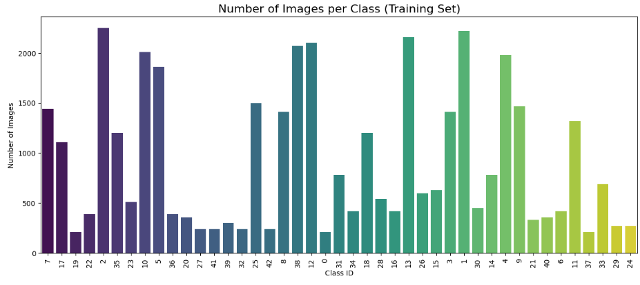
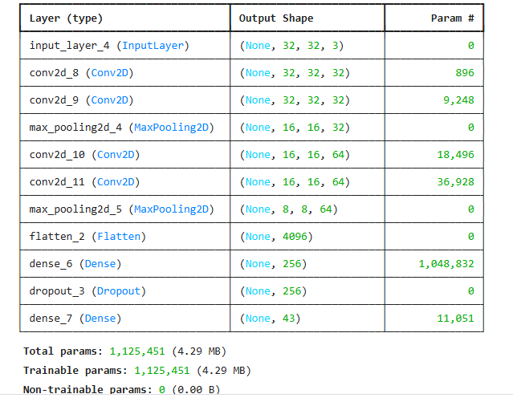
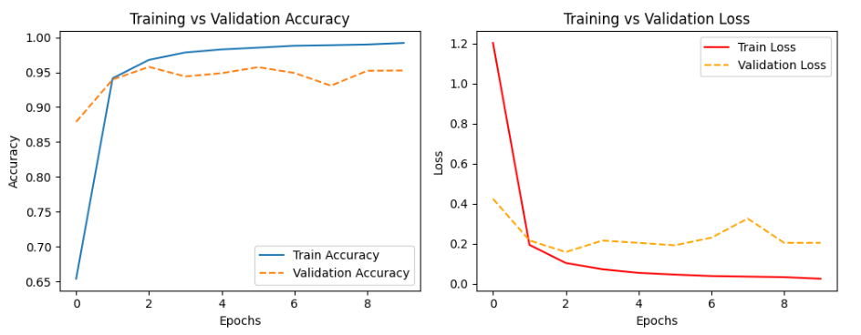
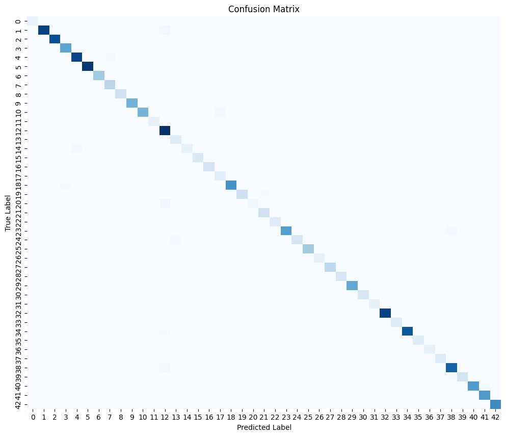
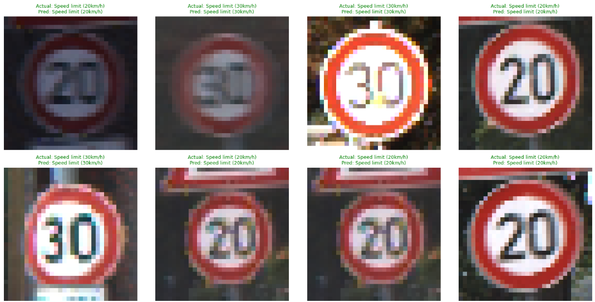

# German Traffic Sign Recognition


## Project Overview
This project aims to classify German traffic signs using deep learning techniques. A Convolutional Neural Network (CNN) is trained on the [GTSRB (German Traffic Sign Recognition Benchmark)](https://www.kaggle.com/datasets/meowmeowmeowmeowmeow/gtsrb-german-traffic-sign) dataset to recognize 43 different traffic sign classes.  

The model includes image preprocessing, augmentation, training, evaluation, and visualization of results using accuracy, loss curves, and confusion matrices.

---

## Features
- Image preprocessing (resizing, normalization)
- Data augmentation to improve generalization
- Custom CNN architecture
- Evaluation on test data with classification report and confusion matrix
- Visualization of sample predictions
- Optional: Comparison with pre-trained models (e.g., MobileNet)

---

## Dataset
**GTSRB (German Traffic Sign Recognition Benchmark)**  
- Training images: 31,368  
- Testing images: 7,841  
- 43 traffic sign classes  
- Images of size 32x32 (after preprocessing)

---

---

## Methodology
1. **Data Preprocessing**:  
   - Resize images to 32x32  
   - Normalize pixel values  
   - Split dataset into training and validation (80/20)

2. **Data Augmentation**:  
   - Random rotations, shifts, flips  
   - Helps prevent overfitting

3. **CNN Architecture**:  
Input -> Conv2D -> Conv2D -> MaxPooling
-> Conv2D -> Conv2D -> MaxPooling
-> Flatten -> Dense(256) -> Dropout(0.5) -> Dense(43, softmax)

   - Optimizer: Adam  
- Loss: Categorical Crossentropy  
- Metrics: Accuracy

4. **Evaluation**:  
- Accuracy & Loss curves  
- Confusion matrix  
- Classification report (Precision, Recall, F1-score)  
- Sample prediction visualization

---

## Sample Results

### Samples Per Class


### CNN Model 


### Accuracy & Loss Curves


### Confusion Matrix


### Sample Predictions
Correct predictions are shown in **green**, incorrect in **red**:


---

## Evaluation Metrics
- **Accuracy**: Percentage of correctly classified images  
- **Precision**: Fraction of correct positive predictions  
- **Recall**: Fraction of actual positives correctly identified  
- **F1-Score**: Harmonic mean of precision and recall  

---

## Future Work
- Transfer learning with **MobileNet / ResNet / EfficientNet**
- Hyperparameter tuning for higher accuracy
- Deployment for **real-time traffic sign recognition** (web/mobile)
- Expand dataset with **synthetic data augmentation**

---

## Installation
```bash
git clone https://github.com/<your-username>/german-traffic-sign-recognition.git
cd german-traffic-sign-recognition
pip install -r requirements.txt

## Requirements
- Python 3.x
- TensorFlow / Keras
- OpenCV
- Pandas, NumPy, Matplotlib, Seaborn
- PIL

Install dependencies:
```bash
pip install tensorflow keras opencv-python pandas numpy matplotlib seaborn pillow
